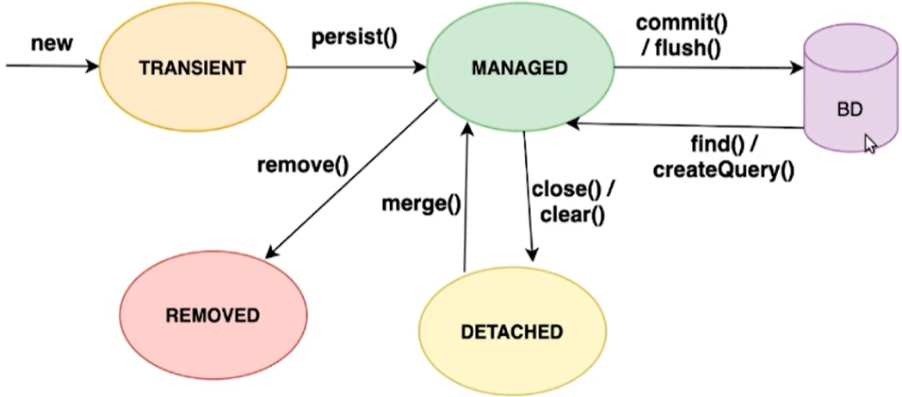

# JPA - Java Persistence API

**Parte 1**
- [Background](#background);
- [Criando o projeto](#criando-o-projeto);
- [Mapeando entidades](#mapeando-entidades);
- [Persistindo uma entidade](#persistindo-uma-entidade);
- [Mapeando *enums*](#mapeando-enums);
- [Mapeando relacionamentos](#mapeando-relacionamentos);
- [Estados no *INSERT* da entidade](#estados-no-insert-da-entidade);
- [Estados no *UPDATE* da entidade](#estados-no-update-da-entidade);
- [Estados no *DELETE* da entidade](#estados-no-delete-da-entidade);
- [Consultando entidades](#consultando-entidades);
- [Consultas com filtros](#consultas-com-filtros);
- [Limitando dados de uma consulta](#limitando-dados-de-uma-consulta).

**Parte 2**
- [Relacionamentos *many-to-many*](#relacionamentos-many-to-many);
- [Relacionamentos bidirecionais](#relacionamentos-bidirecionais);
- [Consultas com funções de agregação](#consultas-com-funções-de-agregação);
- [Consultas para relatórios](#consultas-para-relatórios);
- [Utilizando named queries](#utilizando-named-queries);
- [Entendendo Lazy e Eager](#entendendo-lazy-e-eager);
- [Consultas com Join Fetch](#consultas-com-join-fetch);
- [Consultas com parâmetros dinâmicos](#consultas-com-parâmetros-dinâmicos);
- [Consultas com Criteria API](#consultas-com-criteria-api);
- [Simplificando entidades com *Embeddable*](#simplificando-entidades-com-embeddable);
- [Mapeamento de herança](#mapeamento-de-herança);
- [Mapeamento de chaves compostas](#mapeamento-de-chaves-compostas).

---

- Motivação para utilizar JPA;
- Download e configurações;
- Arquivo `persistence.xml`;
- Mapeamento de entidades;
- Mapeamento de relacionamentos;
- Ciclo de vida de uma entidade;
- Consultas com JPQL.

## Background

O Java nasceu em 1995 e, em 1997 nasceu a JDBC; antes dela, se desejássemos acessar um banco de dados era necessário aprender tecnologias de **socket**, abrir a conexão com o banco e fazer toda a comunicação manualmente com o protocolo específico daquele banco. A JDBC nada mais é do que uma especificação para realizar o acesso a bancos de dados relacionais no Java, uma camada de abstração que independe de protocolo, precisa apenas do driver do banco: um arquivo JAR com a implementação daquele banco de dados em cima da JDBC; isso traz algumas facilidades, como a possibilidade de mudar o banco de dados sem precisar modificar grande parte do código de configuração, apenas trocando o driver.

Para não ficar com código do banco de dados espalhado em vários pontos da aplicação, um padrão de projeto muito utilizado é o “DAO”, onde se isola toda a API da JDBC dentro de uma camada; basicamente precisamos então de _Controllers_ com a regra de negócios que chamam a DAO para fazer a ponte com o banco. O problema é que a JDBC é uma API muito antiga, verbosa e burocrática: é necessário lidar com classes como `Connection` e `ResultSet`; também é necessário o uso de `tryCatch()`, pois elas lançam exceções _checked_ e, além disso, é necessário montar as queries SQL manualmente e utilizar `PreparedStatement` para evitar _SQL Injection_.

Este tipo de código, principalmente por ser muito verboso (cerca de 30 linhas para salvar um produto no banco de dados), de difícil manutenção e ter alto acoplamento com o banco de dados (qualquer alteração no banco, como renomear uma tabela, gera um impacto imenso no código), motivou o surgimento de tecnologias como o Hibernate e a JPA.

O Hibernate foi criado por Gavin King e lançado em 2001 com a ideia de simplificar a JDBC; posteriormente ele foi contratado pela JBoss (Red Hat) para dar continuidade ao projeto. Conforme o tempo passou, foram surgindo novas versões do Hibernate, que ficou famoso no mundo inteiro pois as pessoas não queriam utilizar JDBC e EJB 2; como se tratava de uma biblioteca do mercado, surgiram também concorrentes, e isso gerou o velho problema de dependência de bibliotecas, onde para migrar de uma biblioteca para outra haveria um impacto considerável no código.

A Sun, a Oracle, o Java, não gostam dessa dependência porque significa estar preso a um fornecedor, então foi criada posteriormente uma padronização da biblioteca, do modelo de persistência, que ficou conhecida como ORM (Object Relational Mapping) em Java, com a intenção de fazer o mapeamento, a ponte entre o mundo da Orientação a Objetos com o relacional do banco de dados. Essa especificação, chamada de Java Persistence API, foi lançada em 2006 e criou um padrão para que ninguém ficasse refém de bibliotecas; ou seja, os frameworks e bibliotecas começaram a implementar a JPA, fazendo com que no código se utilize as classes e interfaces da especificação. Dessa forma, as bibliotecas se tornam apenas uma implementação, e para trocar de implementação só é necessário alterar os JARs e algumas configurações, mas tem impacto reduzido no código.

Em 2009 foi lançada a JPA 2.0, implementada pelo Hibernate em 2010; hoje em dia, no mercado, as principais implementações são o Hibernate, o EclipseLink (implementação de referência, é onde são realizados os testes e o lançamento da nova versão da JPA) e o OpenJPA. Para utilizar a JPA precisamos de uma implementação, pois ela é só a abstração; o Hibernate, como é a implementação mais antiga, é a padrão, mas nada impede que se utilizem outras e até se troque de implementação, pois tudo o que estiver na especificação vai funcionar; o que pode ocorrer é a perca de algum recurso específico de uma biblioteca ao trocar por outra, por isso essa troca deve haver essa consideração e cuidado ao realizar a troca.

## Criando o projeto

Para criar um projeto com JPA e Hibernate, basta adicionar o Hibernate como dependência no `pom.xml` e ele já traz tudo o que é necessário; também é preciso adicionar o driver do banco que se deseja utilizar.

### `persistence.xml`

Na JPA, é possível realizar as configurações via código Java, mas o padrão criar o arquivo `persistence.xml`. **Este arquivo deve ficar localizado na pasta _META-INF_, em src/resources**. O esqueleto do arquivo, com os **namespaces** e a tag raiz `persistence`, é o seguinte:

```xml
<!-- javax -->
<?xml version="1.0" encoding="UTF-8"?>
<persistence version="2.2"
	xmlns="http://xmlns.jcp.org/xml/ns/persistence"
	    xmlns:xsi="http://www.w3.org/2001/XMLSchema-instance"
	    xsi:schemaLocation="http://xmlns.jcp.org/xml/ns/persistence http://xmlns.jcp.org/xml/ns/persistence/persistence_2_2.xsd">
</persistence>

<!-- jakarta -->
<?xml version="1.0" encoding="UTF-8"?>
<persistence version="3.0"
	xmlns="https://jakarta.ee/xml/ns/persistence"
	xmlns:xsi="http://www.w3.org/2001/XMLSchema-instance"
	xsi:schemaLocation="https://jakarta.ee/xml/ns/persistence https://jakarta.ee/xml/ns/persistence/persistence_3_0.xsd">
</persistence>
```

Todas as configurações são realizadas dentro da tag `persistence`, sendo que existe uma tag obrigatória chamada `persistence-unit` com duas propriedades principais:

- `name`: podemos colocar o nome que quisermos, serve apenas para diferenciar caso exista mais de uma tag `persistence-unit`;
- `transaction-type`: possui dois valores possíveis: `JTA` e `RESOURCE_LOCAL`; a opção *JTA* é utilizada quando se trabalha com servidores de aplicação que se encarregam de cuidar da transação, e a opção _RESOURCE_LOCAL_ é para aplicações _stand-alone_, sem servidores de aplicação, onde nós gerenciaremos a transação.

Dentro da tag `persistence-unit` vão todas as configurações da aplicação; devemos pensar nela como um banco de dados. Se a aplicação utilizar mais de um banco de dados, deve ter uma `persistence-unit` para cada banco. Dentro da tag adicionamos propriedades para ensinar a detalhes referentes a aplicação para a JPA; para isso é criada uma tag `properties` e cada propriedade se torna uma tag `property` com `name` e `value`.

Algumas propriedades são obrigatórias e específicas da JPA; elas são referenciadas com o `name` `javax.persistence.` e o nome da configuração, e o seu valor é colocado em `value`, como no exemplo abaixo, configurando o driver do banco (uma classe Java), a String de conexão e o username e password:

```xml
<persistence-unit name="jpa-course" transaction-type="RESOURCE_LOCAL">
		<properties>
			<!-- Estas são as propriedades obrigatórias da JPA: -->
			<property name="jakarta.persistence.jdbc.driver" value="org.h2.Driver" />
			<property name="jakarta.persistence.jdbc.url" value="jdbc:h2:mem:jpa_store" />
			<property name="jakarta.persistence.jdbc.user" value="sa" />
			<property name="jakarta.persistence.jdbc.password" value="" />
		</properties>
	</persistence-unit>
```

> A JPA nada mais é do que uma camada de abstração em cima da JDBC; por baixo dos panos, a JPA trabalha com JDBC, or isso utilizamos as propriedades da JDBC.
> 

Existem propriedades específicas da implementação da JPA que estamos utilizando, por exemplo, como estamos utilizando o Hibernate, podemos colocar algumas propriedades específicas dele, como o dialeto do banco de dados e comandos para mostrar e formatar o SQL gerado:

```xml
<!-- O valor será a classe do Hibernate que representa o dialeto: -->
<property name="hibernate.dialect" value="org.hibernate.dialect.H2Dialect" />
<!-- propriedades para mostrar o SQL gerado no console e formatá-lo: -->
<property name="hibernate.show_sql" value="true" />
<property name="hibernate.format_sql" value="true" />
```

O arquivo `persistence.xml` pode até parecer muito complicado, mas se trata, basicamente, de configuração, e precisamos configurar apenas uma vez. A ideia é ensinar para a JPA detalhes do nosso banco de dados para que ela consiga se conectar e acessar o banco de dados corretamente. A JPA depende disso para se unir ao JDBC e acessar o banco de dados.

## Mapeando entidades

Para realizar o **mapeamento** objeto-relacional, criamos uma classe que representará a tabela; na JPA, essas classes são denominadas Entidades. A partir da versão 2.0 podemos realizar tudo via anotações, lembrando sempre de importar o código da JPA e não da implementação.

- `@Entity`: define a classe como uma entidade;
- `@Table(name = "nome_tabela")`: por padrão a JPA considera o nome da entidade como o nome da tabela, então esta anotação serve para ensinar o nome correto da tabela caso ele seja diferente do nome da classe;
- `@Column(name = “column_name”)`: semelhante a `Table`, serve para definir o nome de um atributo dentro da tabela caso seu nome na classe esteja diferente;
- `@Id`: define o atributo como chave primária;
- `@GeneratedValue(strategy = )`: quando é o banco de dados que lida com a chave primária adicionamos essa anotação; o parâmetro `strategy` aceita as opções `IDENTITY`, `SEQUENCE` e `TABLE`, sendo `IDENTITY` geralmente utilizado quando não tem `SEQUENCE` no banco de dados, e `SEQUENCE` quando tem.

Basicamente, a entidade ficaria assim:

```java
package models;

import java.math.BigDecimal;

import jakarta.persistence.Entity;
import jakarta.persistence.GeneratedValue;
import jakarta.persistence.GenerationType;
import jakarta.persistence.Id;
import jakarta.persistence.Table;

@Entity
@Table(name = "produtos")
public class Produto {

	@Id
	@GeneratedValue(strategy = GenerationType.IDENTITY)
	private long id;
	private String nome;
	private String descricao;
	private BigDecimal preco;

	public long getId() {
		return id;
	}

	public void setId(long id) {
		this.id = id;
	}

	public String getNome() {
		return nome;
	}

	public void setNome(String nome) {
		this.nome = nome;
	}

	public String getDescricao() {
		return descricao;
	}

	public void setDescricao(String descricao) {
		this.descricao = descricao;
	}

	public BigDecimal getPreco() {
		return preco;
	}

	public void setPreco(BigDecimal preco) {
		this.preco = preco;
	}
}
```

Um último detalhe: pela JPA é necessário, além de mapear as entidades utilizando as anotações, adicionar as classes no `persistence.xml`, dentro da tag `persistence-unit`; cada classe vira uma tag `class` com o nome completo da classe:

```xml
...
<persistence-unit name="jpa-course" transaction-type="RESOURCE_LOCAL">
		<class>models.Produto</class>
		
		<properties>
...
```

No entanto, utilizando o Hibernate isso não é necessário pois ele consegue encontrar automaticamente as classes/entidades da nossa aplicação; porém, se adicionarmos uma entidade sequer no `persistence.xml`, devemos adicionar todas, pois o Hibernate irá olhar apenas para as que estiverem declaradas. Ou seja, ou adicionamos todas ou não adicionamos nenhuma.

## Persistindo uma entidade

Como não criamos a tabela no banco, precisamos adicionar a seguinte propriedade no arquivo `properties.xml`:

```xml
<property name="hibernate.hbm2ddl.auto" value="update" />
```

Essa propriedade aceita os seguintes valores:

- `create`: cria o banco do zero toda vez que um `EntityManagerFactory` é criado, destruindo dados anteriores;
- `create-only`: gera a criação do banco;
- `create-drop`: cria as tabela quando rodamos a aplicação e faz o drop quando ela é encerrada;
- `update`: apenas atualiza as tabelas se houver alguma alteração ou as cria se não existirem (somente adiciona coisas novas, não remove nada);
- `drop`: gera o drop do banco;
- `validate:` valida o banco, sem gerar nenhuma mudança.

Para visualizar o SQL gerado pelo hibernate, também podemos adicionar a propriedade `show_sql`:

```xml
<property name="hibernate.show_sql" value="true" />
```

Prosseguindo, temos que criar uma `EntityManagerFactory` utilizando a classe `Persistence` e passando o nome da nossa `persistence-unit` do `persistence.xml`. Com a factory criada, podemos criar um `EntityManager`.

Devemos lembrar de iniciar e commitar a transação, já que não estamos utilizando um servidor de aplicação que cuide disso; utilizamos o próprio `EntityManager` para fazer isso. No exemplo, estamos criando um produto e utilizando o método `persist` do `EntityManager` para salvar e inserir um registro no banco de dados:

```java
package app;

import java.math.BigDecimal;

import jakarta.persistence.EntityManager;
import jakarta.persistence.EntityManagerFactory;
import jakarta.persistence.Persistence;
import models.Produto;

public class App {
	public static void main(String... args) {
		Produto celular = new Produto();
		celular.setNome("Moto G31");
		celular.setDescricao("4GB RAM, 32GB HD");
		celular.setPreco(new BigDecimal("875.39"));

		EntityManagerFactory emFactory = Persistence.createEntityManagerFactory("default");
		EntityManager em = emFactory.createEntityManager();

		em.getTransaction().begin();
		em.persist(celular);
		em.getTransaction().commit();

		em.close();
	}
}
```

Output:

```
Hibernate: create table produtos (id bigint generated by default as identity, descricao varchar(255), nome varchar(255), preco numeric(38,2), primary key (id))
Hibernate: insert into produtos (descricao,nome,preco,id) values (?,?,?,default)
```

> Se tivéssemos vários bancos de dados na aplicação, teríamos várias tags `persistence-unit`, cada uma com um `name` distinto, e, na hora de criar a *factory*, passaríamos qual é a `persistence-unit`. Desta maneira, a JPA fica sabendo com qual banco ela deve se conectar.
> 

> Ao realizar operações de *escrita* no banco de dados, como `insert`, `update` e `delete`, é necessário o uso de transações.
> 

### Organizando o código

É uma boa prática isolarmos o código da JPA em uma classe DAO, para que não fique espalhado pela aplicação. Também podemos simplificar a criação de um `EntityManager` com uma classe utilitária para isso. O código fica dessa forma:

```java
public class App {
	public static void main(String... args) {
		Produto celular = new Produto("Moto G31", "4GB RAM, 32GB HD", new BigDecimal("879.35"));

		EntityManager em = getEntityManager();
		ProdutoDao produtoDao = new ProdutoDao(em);

		em.getTransaction().begin();
		produtoDao.cadastra(celular);
		em.getTransaction().commit();

		em.close();
	}
}

// isola a lógica de criação e retorna o EntityManager:
class JPAUtil {
	private static final EntityManagerFactory FACTORY = Persistence.createEntityManagerFactory("default");

	public static EntityManager getEntityManager() {
		return FACTORY.createEntityManager();
	}
}

// recebe o ENtityManager (injeção de dependências) e isola o código da JPA:
class ProdutoDao {
	private EntityManager em;
	
	public ProdutoDao(EntityManager em) {
		this.em = em;
	}
	
	public void cadastra(Produto produto) {
		this.em.persist(produto);
	}
}
```

Lembrando que, ao utilizar um _framework_, como o Spring, já receberíamos a classe DAO pronta, com injeção de dependências, e não precisaríamos das linhas onde criamos o `EntityManager`, iniciamos e _commitamos_ a transação e fechamos o **em**; teríamos, basicamente, a linha `dao.cadastra()`. Mas, como estamos estudando a JPA pura, é necessário todo o código de criação.

## Mapeando `enums`

Quando vamos mapear um `enum` e não falamos nada para a JPA, ela cria a coluna como `INTEGER` e salva a ordem do `enum`. Isso não é uma boa prática, pois a ordem pode mudar, podem ser inseridos novos valores no meio, podem ser removidos valores, etc.

O ideal é usarmos a **annotation** `@Enumerated` dizendo para a JPA que queremos que ela deve criar a coluna como `VARCHAR`; esta annotation aceita os parâmetros:

- `EnumType.ORDINAL`: interpreta o `enum` como inteiro;
- `EnumType.STRING`: interpreta o `enum` como String.

Exemplo de código:

```java
@Entity
@Table(name = "produtos")
public class Produto {

	@Id
	@GeneratedValue(strategy = GenerationType.IDENTITY)
	private long id;
	private String nome;
	private String descricao;
	private BigDecimal preco;
	private LocalDate dataCadastro = LocalDate.now();
	@Enumerated(EnumType.STRING)
	private Categoria categoria;
...
}

...
Produto celular = new Produto("Moto G31", "4GB RAM, 32GB HD", new BigDecimal("879.35"), Categoria.CELULARES);
produtoDao.cadastra(celular);
...
```

Output:

```
Hibernate: create table produtos (id bigint generated by default as identity, categoria varchar(255) check (categoria in ('CELULARES','INFORMATICA','LIVROS')), dataCadastro date, descricao varchar(255), nome varchar(255), preco numeric(38,2), primary key (id))
Hibernate: insert into produtos (categoria,dataCadastro,descricao,nome,preco,id) values (?,?,?,?,?,default)
```

## Mapeando relacionamentos

Se transformarmos, no exemplo acima, `Categoria` em uma entidade, com id e nome, a JPA já entende que temos um relacionamento entre duas entidades; no entanto, somos obrigados a informar a cardinalidade deste relacionamento:

```java
@Entity
@Table(name = "categorias")
public class Categoria {

	@Id
	@GeneratedValue(strategy = GenerationType.IDENTITY)
	private long id;
	private String nome;
...
}

@Entity
@Table(name = "produtos")
public class Produto {

	@Id
	@GeneratedValue(strategy = GenerationType.IDENTITY)
	private long id;
	private String nome;
	private String descricao;
	private BigDecimal preco;
	@Column(name="data_cadastro")
	private LocalDate dataCadastro = LocalDate.now();
	// a JPA já entende que é um relacionamento entre duas entidades, devemos apenas dizer a cardinalidade:
	@ManyToOne // um produto tem uma categoria, categorias podem ter vários produtos
	private Categoria categoria;
...
}
```

> o Hibernate, por padrão, já cria o nome dos campos de relacionamento com a sintaxe _snake_case_ (`categoria_id`); no entanto, para campos comuns com nome composto em _camelCase_, é necessário utilizar a anotação `@Column` passando o parâmetro `name` com o nome desejado para aquela coluna.
> 

Lembrando que, desta forma, é preciso que a categoria relacionada ao produto esteja cadastrada no banco de dados; sendo assim, é necessário também uma DAO para categorias:

```java
class CategoriaDao {
	private EntityManager em;
	
	public CategoriaDao(EntityManager em) {
		this.em = em;
	}
	
	public void cadastra(Categoria categoria) {
		this.em.persist(categoria);
	}
}

...
Categoria celulares = new Categoria("Celulares");
Produto celular = new Produto("Moto G31", "4GB RAM, 32GB HD", new BigDecimal("879.35"), celulares);

EntityManager em = getEntityManager();
ProdutoDao produtoDao = new ProdutoDao(em);
CategoriaDao categoriaDao = new CategoriaDao(em);

em.getTransaction().begin();

categoriaDao.cadastra(celulares);
produtoDao.cadastra(celular);

em.getTransaction().commit();
em.close();
...
```

Output:

```
Hibernate: create table categorias (id bigint generated by default as identity, nome varchar(255), primary key (id))
Hibernate: create table produtos (id bigint generated by default as identity, dataCadastro date, descricao varchar(255), nome varchar(255), preco numeric(38,2), categoria_id bigint, primary key (id))
Hibernate: alter table if exists produtos add constraint FK8rqw0ljwdaom34jr2t46bjtrn foreign key (categoria_id) references categorias
Hibernate: insert into categorias (nome,id) values (?,default)
Hibernate: insert into produtos (categoria_id,dataCadastro,descricao,nome,preco,id) values (?,?,?,?,?,default)
```

> A JPA não assume uma cardinalidade padrão quando não anotamos um atributo
> 

## Estados no `INSERT` da entidade

Quando trabalhamos com entidades e chamamos os métodos do `EntityManager`, elas ficam trafegando entre estados no ciclo de vida, e é importante conhecer estes estados para entender como a JPA trabalha.

Quando instanciamos uma entidade ela está em um estado chamado **transient**, ou seja: ela nunca foi persistida, não está salva no banco de dados e o `EntityManager` não a conhece; sendo assim, ela não está sendo gerenciada pelo JPA. Neste estado, se alterarmos ou fizermos qualquer coisa com a entidade, nada será sincronizado com o banco.

Quando chamamos o método `persist()`, a entidade passa para o estado **managed**, que é o principal estado em que uma entidade pode estar. Tudo o que acontece com uma entidade neste estado é observado pela JPA e poderá ser sincronizado com o banco. Por exemplo, dentro de uma transação criamos uma entidade e vamos chamar o método `persist()`, ao fazer o commit a JPA vai ver que a entidade estava como _transient_ e vai fazer um insert gerando um **id**; depois, da chamada do `persist()`, se alterarmos algum atributo, também será realizado o update no banco. Em outras palavras, se alterarmos um atributo de uma entidade que está como _managed_, a JPA sincronizará com o banco de dados nas chamadas de `commit()` ou `flush()`.

A partir do momento em que fechamos o `EntityManager`, como `close()` ou `clear()`, as entidades que estavam como _managed_ passa para um estado chamado **detached**, que é um estado em que a entidade não é mais _transient_ porém não está mais como _managed_. Portanto, qualquer alteração nesta entidade não irá disparar nenhuma ação por parte da JPA no banco.

## Estados no `UPDATE` da entidade

Sempre que uma entidade está no estado **managed**, a JPA detectará as mudanças realizadas e irá sincronizar com o banco de dados no `commit()` ou no `flush()` do `EntityManager`; portanto é assim que funciona um `UPDATE`.

O problema é que não temos como saber se uma entidade está no estado _managed_; se ela estiver no estado **detached** devido a uma chamada do método `clear()` ou ao fechamento do `EntityManager` com o `close()`, o `UPDATE` não ocorrerá.

Se o `EntityManager` não estiver fechado, ou seja, se não foi chamado o método`close()`, quer dizer que ainda podemos trabalhar com ele; no entanto, se foi chamado o método `clear()`, ele não possui mais nenhuma entidade, e nenhuma mudança será observada no banco. Para recolocar uma entidade no estado _managed_ existe o método `merge()`, que recebe uma entidade e retorna a mesma no estado _managed_.

O `merge()` faz um `SELECT` no banco de dados e cria uma nova referência, no estado _managed_, para a entidade recebida; a entidade que passamos como parâmetro para o método `merge()` continua no estado anterior, como **detached**.

Sendo assim, o método _atualiza_ da DAO não precisa, em teoria, fazer nada; ele já recebe uma entidade com as informações alteradas. No entanto, como não sabemos o estado dessa entidade, a forçamos a ficar _managed_ para garantir que quando ocorrer o `flush()` da transação o `UPDATE` será disparado.

```java
public class CategoriaDao {
	private EntityManager em;

	public CategoriaDao(EntityManager em) {
		this.em = em;
	}

	public void atualiza(Categoria categoria) {
		this.em.merge(categoria); // força o estado *******managed*******
	}
}
```

## Estados no `DELETE` da entidade

Existem mais situações, como por exemplo quando o `EntityManager` foi fechado ou quando a entidade está apenas no banco de dados e não temos uma referência para ela. Para trazê-la do banco para o estado _managed_ utilizamos os métodos `find()` ou `createQuery()`.

Já para excluir uma entidade, podemos chamar o método `remove()` do `EntityManager` se a entidade estiver no estado _managed_, fazendo com que ela passe para o estado **removed**; quando o `commit()` ou `flush()` for chamado, vai sincronizar o `remove()` com o banco e disparar um `DELETE` baseado no atributo da chave primária.

A única ressalva é que a entidade precisa estar como _managed_; se ela estiver em outro estado e tentarmos chamar o `remove()` será lançada uma _exception_. No método da DAO, por exemplo, podemos forçar que a entidade esteja como _managed_ antes de excluir, lembrando de reatribuir o valor retornado do `merge()` para que a operação tenha efeito:

```java
public class CategoriaDao {
	private EntityManager em;

	public CategoriaDao(EntityManager em) {
		this.em = em;
	}

	public void remove(Categoria categoria) {
		categoria = em.merge(categoria); // reatribuindo o retorno do método merge
		this.em.remove(categoria);
	}
}
```

Então concluímos que, quando uma entidade nasce ela está no estado **transient**; para salvá-la no banco de dados temos que utilizar o método `persist()` e então temos uma entidade no estado **managed**. Se fecharmos o `EntityManager` (ou dermos um `clear()`), a entidade passa para o estado **detached**, sendo que podemos chamar o método `merge()` para trazê-la novamente para o estado **managed**. Se a entidade está no banco de dados e não temos uma referência para ela, podemos buscá-la com os métodos `find()` ou `createQuery()` e, por fim, podemos excluir uma entidade que está no estado _managed_ do banco com o método `remove()`, e ela passará para o estado **removed**.



## Consultando entidades

A JPA possui alguns métodos que nos permitem trabalhar diretamente com o banco de dados e fazer consultas, seja por ID ou para retornar uma lista de entidades.

Para a busca por ID, o `EntityManager` possui um método chamado `find()` que recebe dois parâmetros: a classe da entidade que queremos buscar e a chave primária:

```java
...
public Produto buscaPorId(long id) {
	return em.find(Produto.class, id);
}
...
```

Se quisermos carregar várias entidades, teremos que utilizar a **JPQL** (Java Persistence Query Language), que é parecida com SQL e funciona orientada a objetos. Para criarmos uma query, utilizamos o método `createQuery()` do `EntityManager` e passamos o nome da entidade no `SELECT`; para melhorar ainda mais, podemos passar também a classe da entidade que estamos buscando, para inferência de tipo, e devemos chamar o método `getResultList()`, que vai disparar a query e retornar uma lista com os resultados:

```java
public List<Produto> buscaTodos() {
	// buscando o próprio objeto p, a entidade, com todos os atributos:
	String jpql = "SELECT p FROM Produto p";
	return em.createQuery(jpql, Produto.class).getResultList();
}
```

> o método `createQuery()` apenas monta a _query_; para dispará-la, temos que chamar o `getResultList()`.
> 

## Consultas com filtros

Podemos passar parâmetros para a JPQL tanto por nome (**named parameter**) quanto por posição (**positional parameter**). Para passar um parâmetro por nome, utilizamos `:nome-do-parametro` na query e depois chamamos o método `setParameter("nome-do-parametro", valor)`, sem os dois pontos.

Já para passar um parâmetro por posição, utilizamos `?posicao` na query JPQL e depois chamamos o método `setParameter(posicao, valor)`, onde `posicao` é um número inteiro. Também podemos ter quantos parâmetros quisermos, semelhante ao SQL:

```java
...
public List<Produto> filtraPorNome(String nome) {
	String jpql = "SELECT p FROM Produto p WHERE p.nome LIKE :nome"; // os dois pontos são apenas na JPQL!
	return em.createQuery(jpql, Produto.class).setParameter("nome", "%" + nome + "%").getResultList();
}

public List<Produto> filtraPorCategoriaEPreco(Categoria categoria, BigDecimal precoMinimo, BigDecimal precoMaximo) {
	String jpql = "SELECT p FROM Produto p WHERE p.categoria = :categoria AND p.preco BETWEEN :precoMin AND :precoMax";
	// podemos passar vários filtros, assim como no SQL:
	return em.createQuery(jpql, Produto.class)
			.setParameter("categoria", categoria)
			.setParameter("precoMin", precoMinimo)
			.setParameter("precoMax", precoMaximo)
			.getResultList();
}
...
public List<Categoria> filtraPorNome(String nome) {
	String jpql = "SELECT c FROM Categoria c WHERE c.nome LIKE ?1";
	return em.createQuery(jpql, Categoria.class).setParameter(1, "%" + nome + "%").getResultList();
}
...
```

Na JPA, também é possível utilizar a JPQL para fazer consultas envolvendo relacionamentos; por exemplo: em uma entidade `Produto` que possui um atributo `Categoria` referenciando outra entidade, podemos chamar atributos da categoria via produto com a sintaxe `produto.categoria.xpto`; na JPQL, podemos utilizar o operador `.` para gerar um _join_, pois a JPA entende que que há um relacionamento entre duas entidades:

```java
public List<Produto> filtraPorNomeDaCategoria(String nomeDaCategoria) {
	String jpql = "SELECT p FROM Produto p WHERE p.categoria.nome LIKE :nome";
	return em.createQuery(jpql, Produto.class).setParameter("nome", "%" + nomeDaCategoria + "%").getResultList();
}
```

## Limitando dados de uma consulta

Até então estávamos fazendo consultas e carregando entidades inteiras; no entanto, se quisermos apenas um atributo, devemos utilizar outro método. Por exemplo, se quisermos buscar apenas o preço de um produto, faremos a _query_ JPQL selecionando apenas o campo que desejamos buscar u utilizaremos o método `getSingleResult()`:

```java
...
public BigDecimal buscaPrecoDoProduto(long id) {
	String jpql = "SELECT p.preco FROM Produto p WHERE p.id = :id";
	return em.createQuery(jpql, BigDecimal.class).setParameter("id", id).getSingleResult();
}
...
```

Ao fazer uma consulta não precisamos carregar uma entidade inteira; podemos limitar os atributo para trazer a informação que queremos, evitando um `SELECT` desnecessário com muitas informações.

---

# Java e JPA: consultas avançadas, performance e modelos complexos

- Saiba como modelar corretamente relacionamentos bidirecionais
- Aprenda a utilizar o recurso de select new para realizar consultas avançadas
- Entenda a diferença entre relacionamentos EAGER e LAZY
- Conheça o recurso de join fetch para planejar queries
- Conheça a API de Criteria da JPA
- Saiba como mapear entidades que utilizam herança e chave composta

**Parte 2**:

- Mapeamentos _many-to-many_ e bidirecionais;
- Mais consultas (agregação, named queries, select new);
- Lazy, Eager e Join Fetch;
- Criteria API;
- Herança, chaves compostas, etc.

---

## Relacionamentos _many-to-many_

Quando há um relacionamento **many-to-many**, podemos declarar uma `List` com a anotação `@ManyToMany` dentro de uma das classes que a JPA se encarrega de criar a tabela de _join_. Podemos também utilizar a anotação `@JoinTable` para personalizar a tabela gerada.

```java
@Entity
@Table(name = "pedidos")
public class Pedido {
@Id
@GeneratedValue(strategy = GenerationType.IDENTITY)
private long id;
@Column(name = "valor_total")
private BigDecimal valorTotal;
private LocalDate data = LocalDate.now();

@ManyToOne
private Cliente cliente;

@ManyToMany
@JoinTable(name = "produtos_pedido") // opcional
private List<Produto> produtos;
...
```

No entanto, quando a tabela de _join_ necessita de mais informações, não é possível utilizar esta abordagem; sendo assim, devemos mapear uma nova entidade representando os atributos da tabela de _join_. Utilizando o exemplo acima, em um pedido devemos guardar o preço de cada produto no momento da venda, assim como sua quantidade:

```java
@Entity
@Table(name = "itens_pedido")
public class ItemPedido {

	@Id
	@GeneratedValue(strategy = GenerationType.IDENTITY)
	private long id;
	@Column(name = "valor_unitario")
	private BigDecimal valorUnitario;
	private int quantidade;

	@ManyToOne
	private Pedido pedido;

	@ManyToOne
	private Produto produto;
...
}

@Entity
@Table(name = "pedidos")
class Pedido {

	@Id
	@GeneratedValue(strategy = GenerationType.IDENTITY)
	private long id;
	private BigDecimal valorTotal;
	private LocalDate data = LocalDate.now();

	@ManyToOne
	private Cliente cliente;

	@OneToMany(mappedBy = "pedido")
	private List<ItemPedido> itens;
...
}
```

Dessa forma estamos mapeando os dois lados do relacionamento, então temos um relacionamento **bidirecional** entre `ItemPedido` e `Pedido`, evidente nas anotações `@ManyToOne` e `@OneToMany`. Lembrando que isso ocorre pois mapeamos uma nova entidade; se isso não fosse necessário, seria um relacionamento _many-to-many_.

## Relacionamentos bidirecionais

Quando temos um relacionamento bidirecional, ou seja: mapeamos os dois lados de um relacionamento, se não informarmos à JPA que o relacionamento é bidirecional, ela por padrão vai assumir que se tratam de relacionamentos diferentes e irá gerar outras tabelas, pois não interpretará o relacionamento corretamente.

Para informar à JPA que temos um relacionamento bidirecional, devemos passar para a anotação `@OneToMany` do relacionamento o parâmetro `mappedBy` com o nome do atributo que está mapeado na tabela que contém o relacionamento. No caso do exemplo acima, o relacionamento entre `Pedido` e `ItemPedido` está sendo mapeado na entidade `ItemPedido` no atributo `pedido`:

```java
...
public class ItemPedido {
...
	@ManyToOne
	private Pedido pedido;
...
}
...
class Pedido {
...
	@OneToMany(mappedBy = "pedido")
	private List<ItemPedido> itens;
...
}
```

Além de adicionar o `mappedBy` no lado inverso do relacionamento, também é uma boa prática criar nele um método utilitário para evitar que se espalhe o código do relacionamento e garantir que se inicializem os dois lados do mesmo. Seguindo no exemplo, podemos criar um método dentro de `Pedido` que recebe um `Produto` e sua quantidade e cria um novo `ItemPedido`, adicionando-o à lista de itens.

Por fim, podemos passar também o parâmetro `cascade` na anotação `@OneToMany`, informando à JPA que queremos criar um efeito cascata para determinadas operações realizadas envolvendo as entidades do relacionamento. Isso evita, por exemplo, que seja necessário criar uma classe `ItemPedidoDao` para gerenciar os itens do pedido, pois será responsabilidade do relacionamento:

```java
...
public class Pedido {
...
	@OneToMany(mappedBy = "pedido", cascade = CascadeType.ALL)
	private List<ItemPedido> itens = new ArrayList<>();
...
	public void adicionaItem(Produto produto, int quantidade) {
		ItemPedido item = new ItemPedido(quantidade, this, produto);
		itens.add(item);
	}
...
}
```

> Lembrando que para evitar erros de **transient property value** devemos sempre lembrar de persistir as entidades no banco.
> 

## Consultas com funções de agregação

A JPA suporta a utilização de funções SQL, como as funções de agregação padrão `MIN`, `MAX`, `AVG` e `SUM`. Quando a função não é própria do SQL, como funções específicas de alguns bancos, a JPA delega a função para o banco; se o banco entender vai executar a função, senão irá jogar um erro. A sintaxe das funções SQL em JPQL é bem simples e deve referenciar o nome da entidade e de seus atributos conforme declarado no código:

```java
public class PedidoDao {
	private EntityManager em;	
...
	public BigDecimal getValorTotalVendido() {
		// o nome dos atributos buscados deve estar igual na entidade
		String jpql = "SELECT SUM(p.valorTotal) FROM Pedido p";
		return em.createQuery(jpql, BigDecimal.class).getSingleResult();
	}
}
```

## Consultas para relatórios

A JPA nos permite fazer consultas que retornam diferentes tipos de dados; para transformar o retorno dessas consultas em objetos, temos duas abordagens principais. A primeira consiste em utilizar um array de `Object`; obviamente, esta não é a melhor solução, mas funciona dessa forma:

```java
public class PedidoDao {
...
	public List<Object[]> getRelatorioDeVendas() {
		String jpql = """
				SELECT
					produto.nome, SUM(item.quantidade), MAX(pedido.data)
				FROM Pedido pedido
					JOIN pedido.itens item
					JOIN item.produto produto
				GROUP BY produto
				ORDER BY item.quantidade DESC
			""";
		return em.createQuery(jpql, Object[].class).getResultList();
	}
}
```

A outra abordagem, mais apropriada e orientada a objetos, é a de criar uma classe _VO_ (Value Object), ou seja, uma classe que não possui comportamentos e serve apenas para armazenar os dados retornados pela consulta:

```java
package vo;
...
public class RelatorioDeVendasVo {

	private String nomeProduto;
	private long quantidadeVendida;
	private LocalDate ultimaVenda;

	public RelatorioDeVendasVo(String nomeProduto, long quantidadeVendida, LocalDate ultimaVenda) {
		this.nomeProduto = nomeProduto;
		this.quantidadeVendida = quantidadeVendida;
		this.ultimaVenda = ultimaVenda;
	}
...
}
```

Para utilizar essa classe na JPA existe o recurso `SELECT NEW`, utilizado dentro da _query_ JPQL para instanciar um novo objeto que será retornado como resultado; devemos passar o nome completo da classe que desejamos instanciar com o `SELECT NEW` para evitar problemas:

```java
public class PedidoDao {
...
	public List<RelatorioDeVendasVo> getRelatorioDeVendas() {
		// devemos passar o nome completo da classe no select new para evitar problemas
		String jpql = """
				SELECT NEW vo.RelatorioDeVendasVo(
					produto.nome AS nome,
					SUM(item.quantidade) AS quantidade,
					MAX(pedido.data) AS ultimaVenda
				) FROM Pedido pedido
					INNER JOIN pedido.itens item
					INNER JOIN item.produto produto
				GROUP BY nome
				ORDER BY quantidade DESC, ultimaVenda DESC
			""";
		return em.createQuery(jpql, RelatorioDeVendasVo.class).getResultList();
	}
}
```

> A classe VO deve conter um construtor compatível com a consulta JPQL!
> 

## Utilizando named queries

É possível armazenar consultas JPQL junto com as entidades utilizando a anotação `NamedQuery`:

```java
@Entity
@Table(name = "produtos")
@NamedQuery(name = "Produto.filtraPorNomeDaCategoria", query = "SELECT p FROM Produto p WHERE p.categoria.nome LIKE :nome")
public class Produto {
...
}
```

Para rodar as consultas armazenadas nestas anotações, é necessário utilizar o método `createNamedQuery` do `EntityManager` e passar por parâmetro o nome da _query_ e qual a entidade resultante da consulta:

```java
public class ProdutoDao {
...
	public List<Produto> filtraPorNomeDaCategoria(String nomeDaCategoria) {
		return em.createNamedQuery("Produto.filtraPorNomeDaCategoria", Produto.class)
				.setParameter("nome", "%" + nomeDaCategoria + "%")
				.getResultList();
		}
}
```

## Entendendo Lazy e Eager

Para a JPA, por padrão, todos os relacionamentos **ToOne** possuem carregamento **Eager**, ou seja, são realizados _joins_ e eles são carregados do banco de dados mesmo que nenhuma propriedade sua seja necessária; por exemplo, se o produto tem um relacionamento `ManyToOne` com categoria e fazemos um `SELECT` do produto, serão trazidos todos os dados da categoria. Isso pode se tronar um problema, pois podemos ter muitos relacionamentos _ToOne_ ou pode ser gerado um efeito cascata, buscando todos os relacionamentos _ToOne_ subsequentes na consulta.

A outra forma de carregamento é chamada de _Lazy_ e busca os dados dos relacionamentos apenas quando tentamos acessá-los. Por padrão para a JPA, todos os relacionamentos **ToMany** são **Lazy**. Para alterar o tipo de carregamento do relacionamento é necessário ir na sua anotação e passar o parâmetro `fetch`, que pode receber os valores `FetchType.LAZY` e `FetchType.EAGER`:

```java
@Entity
@Table(name = "itens_pedido")
public class ItemPedido {
...
	@ManyToOne(fetch = FetchType.LAZY)
	private Pedido pedido;

	@ManyToOne(fetch = FetchType.LAZY)
	private Produto produto;
...
}
```

> É uma boa prática sempre alterar o carregamento dos relacionamentos _toOne_ para **Lazy**.
> 

## Consultas com Join Fetch

Um efeito colateral que pode ocorrer ao transformar todos os relacionamentos em _Lazy_ é que, posteriormente à busca, ao tentar acessar uma informação que não foi trazida do banco, podemos receber uma `LazyInitializationException` pois o `EntityManager` pode estar fechado.

A solução para isso é utilizar um recurso chamado de _query planejada_, ou seja, ao invés de utilizar apenas o método `find()`, ter um método com uma query que vai retornar todos os campos necessários naquele momento. Para isso utilizamos um `JOIN FETCH`, que é responsável por fazer com que um determinado relacionamento _Lazy_ se comporte como _Eager_ naquela determinada consulta, trazendo todos os campos selecionados e evitando sobrecargas e gargalos de consultas:

```java
public class PedidoDao {
...
	public Pedido buscaPorIdComCliente(long id) {
		String jpql = "SELECT p FROM Pedido p JOIN FETCH p.cliente WHERE p.id = :id";
		return em.createQuery(jpql, Pedido.class).setParameter("id", id).getSingleResult();
	}
}
```

> O `JOIN FETCH` nos permite escolher quais os relacionamentos que serão carregados em determinada consulta.
> 

## Consultas com parâmetros dinâmicos

Se quisermos realizar consultas com parâmetros opcionais, teremos que utilizar uma “gambiarra” famosa para criar a _query_; isso porque vai ser necessário fazer um `if` para cada parâmetro e, se ele for válido, concatená-lo na _query_ com `AND`. No entanto, como vamos garantir que o `WHERE` já está na _query_ para podermos concatenar os novos parâmetros? A resposta é `WHERE 1=1`, ou seja, colocamos uma expressão que sempre vai retornar verdadeiro e podemos concatenar parâmetros à vontade com `AND`:

```java
public class ProdutoDao {
...
	public List<Produto> buscarPorParametros(String nome, BigDecimal preco, LocalDate dataCadastro) {
		// gambiarra para concatenar ANDs:
		String jpql = "SELECT p FROM Produto p WHERE 1=1 ";

		if (nome != null && !nome.trim().isEmpty()) jpql += " AND p.nome = :nome ";

		if (preco != null) jpql += " AND p.preco = :preco ";

		if (dataCadastro != null) jpql += " AND p.dataCadastro = :dataCadastro ";

		TypedQuery<Produto> query = em.createQuery(jpql, Produto.class);

		if (nome != null && !nome.trim().isEmpty()) query.setParameter("nome", nome);

		if (preco != null) query.setParameter("preco", preco);

		if (dataCadastro != null) query.setParameter("dataCadastro", dataCadastro);

		return query.getResultList();
	}
}
```

Perceba que são necessários `IF`s duplicados, para concatenar os parâmetros e posteriormente defini-los. Para solucionar este problema, foi implementado na JPA um recurso que á existia no Hibernate.

## Consultas com Criteria API

Para utilizar a Criteria API da JPA, que é mais complicada que a do Hibernate, precisamos de um objeto `CriteriaBuilder`, que é obtido do `EntityManager`; Com este objetos, criamos uma _query_ do tipo `CriteriaQuery` passando a entidade. Depois disso, é necessário também dizer onde será executada a _query_, no caso o campo `FROM`; isto retorna um objeto do tipo `Root`.

Após, para adicionar os parâmetros, é necessário criar um objeto `Predicate` e, para cada parâmetro que desejamos adicionar, é necessário substituir este `Predicate` chamando o método do `CriteriaBuilder` que queremos usar para concatenar os parâmetros e passando o `Predicate` antigo e o método de comparação, que recebe a coluna/atributo que queremos usar como parâmetro buscada no `Root` e o valor que será passado como parâmetro.

```java
public class ProdutoDao {
...
	public List<Produto> buscarPorParametrosComCriteria(String nome, BigDecimal preco, LocalDate dataCadastro) {
		CriteriaBuilder builder = em.getCriteriaBuilder();
		CriteriaQuery<Produto> query = builder.createQuery(Produto.class);
		Root<Produto> from = query.from(Produto.class);

		Predicate filtros = builder.and();
		// para adicionar parâmetros, é necessário substituir o Predicate; para isso, chamamos o método do CriteriaBuilder
		// que desejamos utilizar para concatenar o parâmetros e passamos o Predicate antigo, e o método de comparação, que
		// recebe o campo que desejamos usar como parâmetro buscado no Root e o valor passado para substituir este parâmetro:
		if (nome != null && !nome.trim().isEmpty())
			filtros = builder.and(filtros, builder.like(from.get("nome"), "%" + nome + "%"));

		if (precoMin != null) filtros = builder.and(filtros, builder.greaterThan(from.get("preco"), precoMin));

		if (dataCadastro != null) filtros = builder.and(filtros, builder.equal(from.get("dataCadastro"), dataCadastro));

		query.where(filtros);

		return em.createQuery(query).getResultList();
	}
}
```

> Cuidado: API de Criteria torna o código mais difícil de entender.
> 

## Simplificando entidades com `Embeddable`

Podemos utilizar composição com a JPA; para isso, é necessário utilizar a anotação `Embedded` dentro da entidade para a classe que é a responsável pela composição, e a anotação `@Embeddable` nesta última:

```java
@Entity
@Table(name = "clientes")
public class Cliente {

	@Id
	@GeneratedValue(strategy = GenerationType.IDENTITY)
	private long id;
	@Embedded //informando à JPA que os atributos de DadosPessoais são colunas de Cliente
	private DadosPessoais dadosPessoais;
...
}

@Embeddable
record DadosPessoais(String nome, String cpf) {}
```

Esse recurso é útil para evitar classes muito grandes e cheias de atributos, quebrando-as em partes menores e simplificando o código.

## Mapeamento de herança

A JPA suporta algumas estratégias de mapeamento de herança; vamos abordar as duas principais, sendo a primeira delas a **Single Table**, que junta todas as subclasses, com seus atributos específicos, em uma única tabela. Essa estratégia é mais performática pois não necessita de _joins_, porém acaba misturando vários atributos em uma mesma tabela.

Para utilizar esta abordagem, em cima da classe/entidade mãe, é necessário utilizar a anotação `@Inheritance`, passando como parâmetro `strategy` o valor `SINGLE_TABLE`. Acima das classes filhas só é necessário colocar a anotação `@Entity` que a JPA se encarrega do resto; neste caso, também não é necessário `id`, pois já está sendo herdado da classe mãe:

```java
@Entity
@Table(name = "produtos")
@Inheritance(strategy = InheritanceType.SINGLE_TABLE)
public class Produto {
	@Id
	@GeneratedValue(strategy = GenerationType.IDENTITY)
	private long id;
	private String nome;
	private String descricao;
	private BigDecimal preco;
...
}

@Entity
public class Livro extends Produto {
	private String autor;
	private int numeroDePaginas;
...
}

@Entity
public class Informatica extends Produto {
	private String autor;
	private String modelo;
...
}
```

Output da criação da tabela:

```
Hibernate: create table produtos (
	DTYPE varchar(31) not null,
	id bigint generated by default as identity,
	data_cadastro date, descricao varchar(255),
	nome varchar(255),
	preco numeric(38,2),
	autor varchar(255),
	numeroDePaginas integer,
	modelo varchar(255),
	categoria_id bigint,
primary key (id))
```

Note que o Hibernate cria um atributo chamado `DTYPE`, que serve para armazenar o nome da classe e identificar qual instância está sendo trazida do banco. Essa coluna pode ser personalizada, mas por padrão ela insere como valor o nome da classe.

A outra principal estratégia é a de criar tabelas separadas. Para implementa-la no código acima basta alterar o valor de `strategy` na anotação `@Inheritance` para `JOINED` e, por boa prática, adicionar a anotação `@Table` nas classes filhas para definir seus nomes conforme a convenção do banco de dados. O código ficaria assim:

```java
@Entity
@Table(name = "produtos")
@Inheritance(strategy = InheritanceType.JOINED)
public class Produto {
	@Id
	@GeneratedValue(strategy = GenerationType.IDENTITY)
	private long id;
	private String nome;
	private String descricao;
	private BigDecimal preco;
...
}

@Entity
@Table(name = "livros")
public class Livro extends Produto {
	private String autor;
	private int numeroDePaginas;
...
}

@Entity
@Table(name = "informatica")
public class Informatica extends Produto {
	private String autor;
	private String modelo;
...
}
```

Output de criação das tabelas:

```
Hibernate: create table livros (autor varchar(255), numeroDePaginas integer not null, id bigint not null, primary key (id))
Hibernate: create table pedidos (id bigint generated by default as identity, data date, valor_total numeric(38,2), cliente_id bigint, primary key (id))
Hibernate: create table produtos (id bigint generated by default as identity, data_cadastro date, descricao varchar(255), nome varchar(255), preco numeric(38,2), categoria_id bigint, primary key (id))
```

O principal ponto de atenção com esta estratégia é a possibilidade de queda de performance, pois será necessário um ou mais _joins_ para buscar todas as informações das entidades, mas por outro lado o projeto fica muito mais organizado e limpo.

> A anotação `@Inheritance` deveria ser adicionada apenas na classe base
> 

## Mapeamento de chaves compostas

Para utilizar chaves compostas, separamos os atributos que irão compor a chave e criamos uma nova classe com a anotação `@Embeddable`; é uma boa prática que estas classes que servirão como chaves implementem a interface `Serializable`:

```java
@Embeddable
public record CategoriaId(String nome, String tipo) implements Serializable {}
```

Na entidade, criamos o atributo que será a chave composta utilizando a anotação `@EmbeddedId`, desta forma:

```java
@Entity
@Table(name = "categorias")
public class Categoria {

	@EmbeddedId
	private CategoriaId id;
...
}
```

Agora, para fazer um `find()` por id ou por nome, por exemplo, é necessário instanciar ou buscar uma `CategoriaId` e referenciar o campo `categoria.id.nome`, respectivamente:

```java
public class CategoriaDao {
...
	public Categoria buscaPorId(CategoriaId id) {
		return em.find(Categoria.class, id);
	}

	public List<Categoria> filtraPorNome(String nome) {
		String jpql = "SELECT c FROM Categoria c WHERE c.id.nome LIKE ?1"; // também podemos passar parâmetros por número!
		return em.createQuery(jpql, Categoria.class).setParameter(1, "%" + nome + "%").getResultList();
	}
}
```
